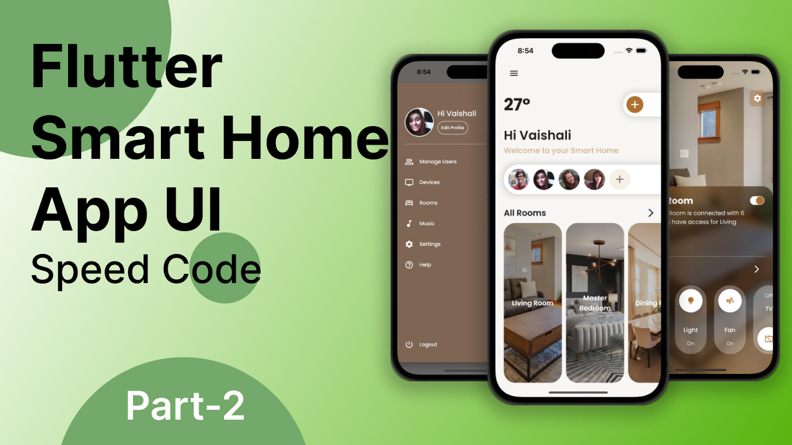

# Smart Home Flutter UI

Smart Home app #UI using #flutter to showcase an ability to control devices at home through Smartphone. On the Home page, you will get all users who can access the app and a list of all room categories which allow users to control devices individually.
There is also a drawer menu present for more accessibility.

# [Watch it on YouTube ](https://youtu.be/TovttAgEmC4)

# [Watch it on Instagram ](https://instagram.com/strength_code)

## Project Created by
### Shahbaj Jamil
 #Flutter, #Android Developer, #ios.
 
         

